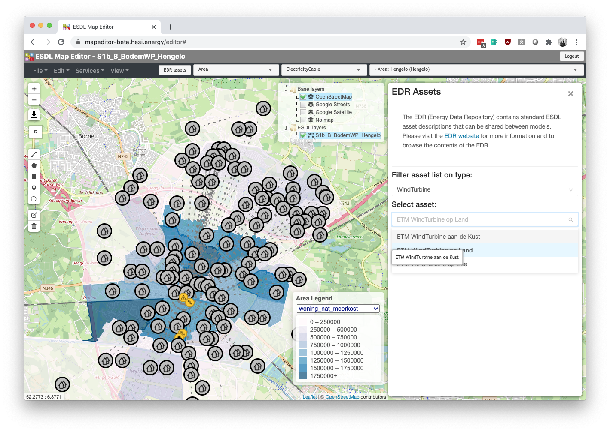
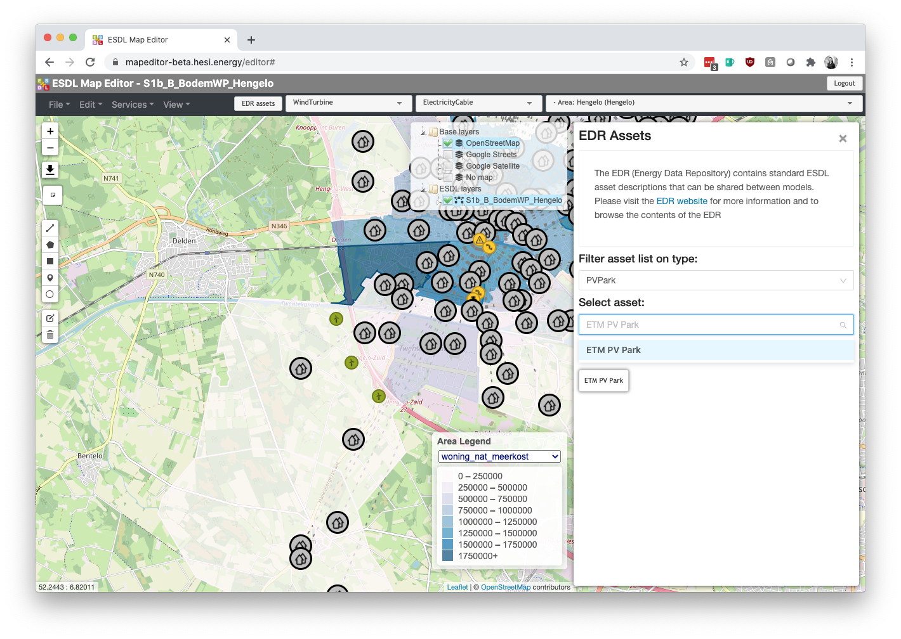

The etm-esdl app allows for converting ESDL files into scenarios on the [Energy Transition Model](https://pro.energytransitionmodel.com/). Please vist the ESDL [documentation](https://energytransition.gitbook.io/esdl/) if you want to learn more about this energy language.

## API for converting ESDL files into ETM scenarios
You can find more info on the api at http://esdl.energytransitionmodel.com/api/v1/

## Installation
The etm-edsl app is a python Flask app that has support for running in Docker. We recommend
installing Docker on your system.

You can download a Docker image, or generate one yourself with `docker-compose build`

If you want to run the app locally in debug and reload-on-change mode, please use `docker-compose up`.
## Using pipenv in development
For development and testing please use pipenv:
```
pip3 install pipenv
pipenv install --dev
pipenv shell
```
The `dev` flag is used to install development dependencies as well (like `pytest`).

Every new session you should reactivate your virtual environment with:
```
 pipenv shell
```
You can exit the virtual environment with `exit`

You can now test your local changes by running pytest:
```
python -m pytest
```

You can update your local dependencies when the Pipfile.lock was updated upstream by using
```
pipenv install --dev --ignore-pipfile
```

When you update the Pipfile manually please relock and install new dependencies by simply
```
pipenv install --dev
```

## Manual

The aim of this manual is to support users in applying the Mondaine suite. More specifically, how to use the ETM as a part of the Mondaine suite.

### Role of the ETM

The ETM is one of the models and tools participating in the Mondaine suite, in addition to [Vesta-MAIS](https://www.pbl.nl/modellen/vesta) (PBL, developed using [GeoDMS](http://www.objectvision.nl/geodms) by Object Vision), [PICO](https://pico.geodan.nl/pico/index.html) (Geodan), and the [ESDL MapEditor](https://mapeditor.hesi.energy/) (TNO).

#### *Added value*

The ETM is an **open-source interactive tool** for energy modeling. It is aimed at anyone who personally wants to explore the possibilities for the future of the energy system. The model is **bottom-up** and **demand-driven** and it ensures that **energy is conserved**. The ETM challenges the user to think about all aspects of the energy future, including supply, demand, flexibility and costs. This makes ETM ideally suited as support for fact-based discussions on energy in the public sector, business and education. The ETM is used by many different parties, among which are grid operators, governmental parties, energy consultants, and NGOs, to justify plans for the future energy system.

In addition to the **yearly energy balance**, the ETM has a **merit order module** that calculates the **hourly electricity mix** based on the demand for electricity and the installed capacities and marginal costs of the electricity producing technologies. The model also performs calculations on an hourly basis for other carriers, such as network gas, hydrogen and heat. If there are any hourly mismatches between demand and supply—think of electricity excesses from volatile producers—the user may explore the impact of **flexibility options** such as storage or conversion techniques.

In order to test the robustness of a scenario, **sensitivity analyses** can be performed. Assumptions related to costs (for instance, fuel prices) can be adjusted or a future year with extreme weather conditions can be selected. The user may explore to what extent these changes affect the future energy system.

At present, the ETM includes models for eight countries, the EU-27, and many Dutch provinces, energy (RES) regions and municipalities.

Summarizing, the ETM:

1. allows you to bring together energy plans at different levels,
2. provides insights into how demand and supply balance on both a yearly and an hourly base, and
3. provides system insights such as CO2 emissions, renewability, energy mix, etc.

#### *Collaboration with other models and tools*

By using the Mondaine suite, users of the ETM are able to exploit the strengths of other models:

* The Map Editor allows to geographically create or edit a scenario and convert it into an ETM scenario. Also, it allows to provide a geographical impression of assumptions made in an ETM scenario. For instance, it allows users to explore the spatial impact of assumptions on the installed capacity of wind turbines and/or solar PV parks.

* Vesta-MAIS is used to calculate the impact of heat transition plans for the built environment on a very detailed level. By using the Mondaine suite, these plans can be aggregated and converted into an ETM scenario. This makes it possible to build further upon the results from Vesta-MAIS.


### Importing and exporting ESDL files

In order for the models and tools to collaborate, ESDL is used to describe relevant parts of the energy system. On the one hand, ESDL energy systems can be used to descripe the output of a model or tool. On the other hand, ESDL energy systems can be used as input for other models or tools.

This app comprises of an interface that allows to

* import an ESDL file and convert it to an ETM scenario
* export an ETM scenario to an ESDL file

#### *Import ESDL files*

ESDL files can be imported and converted into ETM scenarios in two ways: i) in the ESDL MapEditor, or (ii) in the ETM itself. Both ways are described below.

##### Import ESDL files from the ESDL MapEditor

After having loaded an ESDL file in the ESDL MapEditor, you can call one of the external ESDL services.

On the right side of the ESDL MapEditor a frame will pop up that provides an overview of all available ESDL services. Select the "Open" button next to the ETM service. If necessary, change the environment from *pro* to *beta*. However, in nearly all cases you should keep the *pro* environment. This allows you to use the stable version of the ETM. After selecting the "Run Service" button, the ETM service will run.

When the service has been run, an ETM scenario has been created that can be opened by clicking the "Open ETM" link.

This redirects you to the ETM scenario.


##### Import ESDL files from the ETM

WIP

#### *Export ESDL files*

WIP


### Features

During the Mondaine project several features have been developed that can be exploited by ETM users. These involve the following topics:

1. Renewable electricity (wind turbines, solar PV parks)
2. Solar PV on rooftops
3. Heat transition built environment
4. System integration

For each topic, we'll go a bit more in depth below.

#### *1. Renewable electricity (wind turbines, solar PV parks)*

TODO






#### *2. Solar PV on rooftops*

TODO


#### *3. Heat transition built environment*

TODO


#### *4. System integration*

TODO

## Contact

Do you have any questions on the above? Don't bother to contact us!

* Nora ([https://github.com/noracato](https://github.com/noracato))
* Roos ([https://github.com/redekok](https://github.com/redekok))

For more information on the Mondaine Suite, please visit our website: [https://www.mondaine-suite.nl](https://www.mondaine-suite.nl). 
